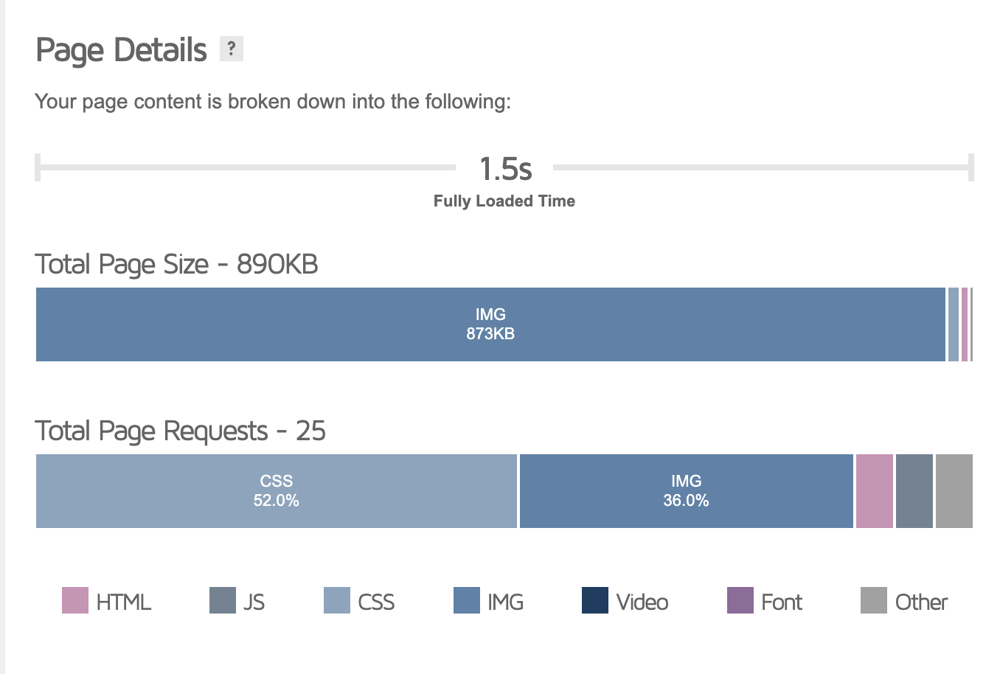
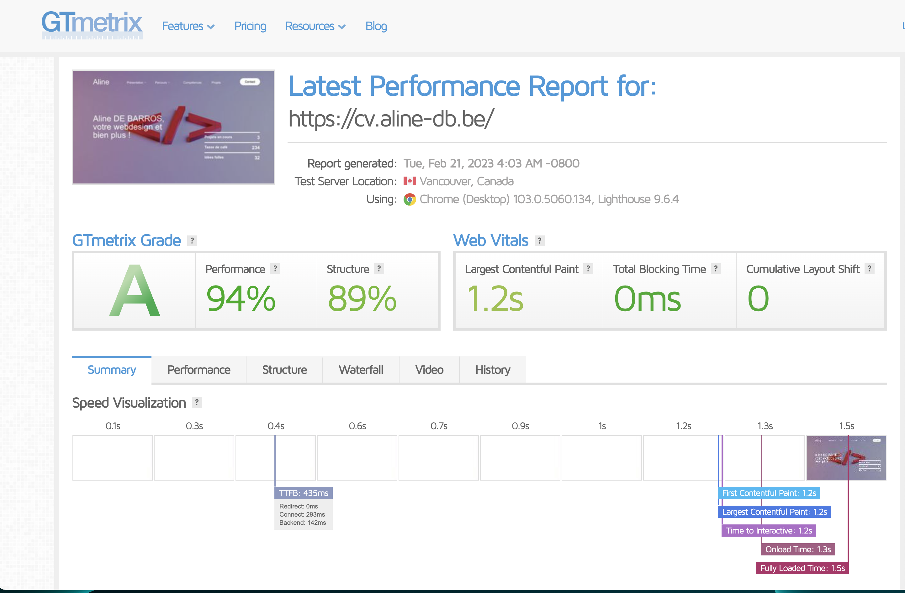
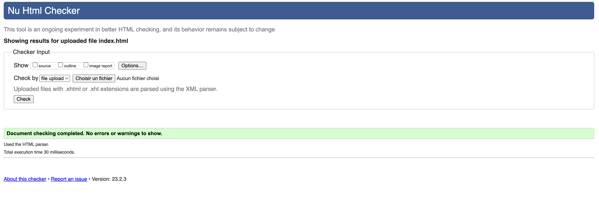
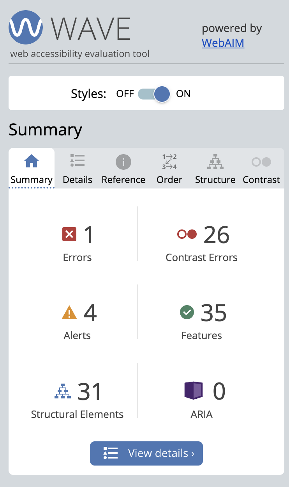
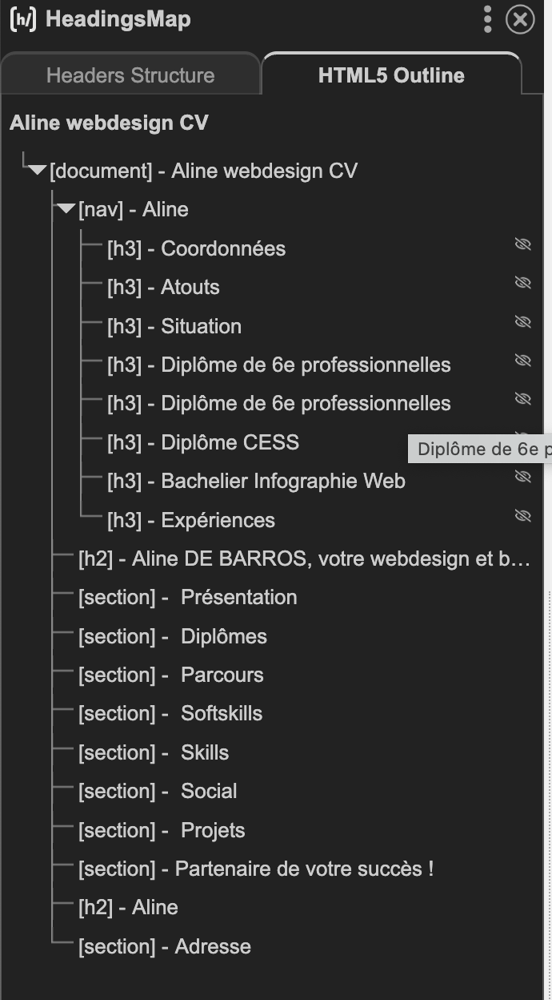
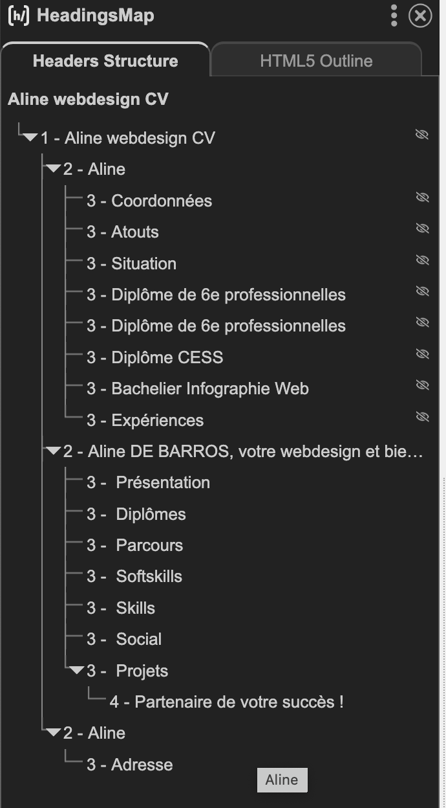

# CV-2023

Site choisi : [Prayon](https://www.prayon.com/en/)

Vidéo du site : [Youtube](https://youtu.be/FHkPmfz4RKw)

Capture d'écran du site : [Photos](https://github.com/AlineDB/CV-2023/tree/main/capture%20d'%C3%A9cran)

Le wireframe et design : [sur XD](https://xd.adobe.com/view/d70a5066-7641-4867-9c4e-d182f7f9ae2b-8259/)

## Tests

### GTMetrix

Bons résultats avec un temps de chargement "correct" mais malgré l'optimisation des images et l'utilisation du srcset, celles-ci prennent 873KB et mettent 1.5s pour être toutes chargées. Ici, ce n'est qu'une page mais pour un site plus conséquent, il faudrait chercher une solution de type Lazy Loading pour encore optimiser ce point.

### W3C Validator

Pour le HTML

Pour le CSS, CSS niveau 3 + SVG et juste un avertissement concernant le webkit pour le border radius.

Je n'ai pas fait la validation des liens car la plupart sont vides et provoqueront des erreurs.

### Wave

Une erreur du au label qui n'est pas visible (il ne sert qu'au burger menu)
Encore des problèmes de contraste pour le header avec l'image sous le texte malgré mes améliorations.
4 alertes pour suggérer de mettre 4 taglines en h?, ce dont je n'ai pas besoin.

### HeadingsMap

Tests concluant

### CSS STATS

Il n'y a pas beaucoup de code (comparé à un site habituel). Taille fichiers 22KB et zippé 4KB.

178 règles, 348 sélecteurs, 57 propriétés, pas d'ID, 235 classes, 55 pseudo-classes et 4 pseudo-éléments.

Le score maximum de spécificité des règles est de 30. 

449 déclarations uniques.

1 border radius, 4 uniques colors sur 20 déclarations, 4 uniques background-color sur 12 déclarations.

## Argumentaire des changements apportés

### Header / En-tête

Le texte étant en blanc, il y a un souci de contraste avec les images/vidéo en arrière plan. Mon premier changement est donc de me limite à une image pour éviter de répéter le problème. J'ai diminué la luminosité de cette image de fond afin de diminuer le problème de contraste un maximum et j'ai augmenté la graisse et la taille de police pour que le texte soit un maximum lisible, étant donné que c'est la première chose que l'on voit/lit en arrivant sur la page.

### Footer / Pied-de-page

En version mobile, le lien vers la page d'accueil et le bouton de contact disparaîssent. J'ai choisi de les laisser en version mobile car, même si le menu est fixe au scroll, si l'utilisateur souhaite revenir à la page d'accueil ou contacter l'entreprise (ou moi-même dans ce cas), il faut qu'il scroll vers le haut pour faire apparaitre le menu, clique sur le burger menu pour avoir le bouton de contact ou cliquer directement sur le lien vers la page d'accueil. Alors qu'en laissant ses actions dans le footer en version mobile il peut le faire dès qu'il arrive en fin de page / de lecture. On parle souvent de CTA et ici les plus importants sont enlevés à la fin de lecture par l'utilisateur alors que c'est un des moments où il a le plus de chance d'effectuer une action.